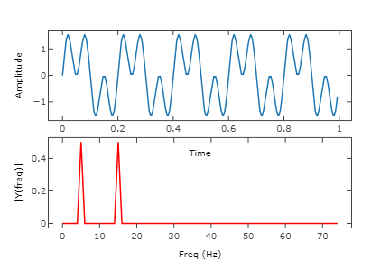
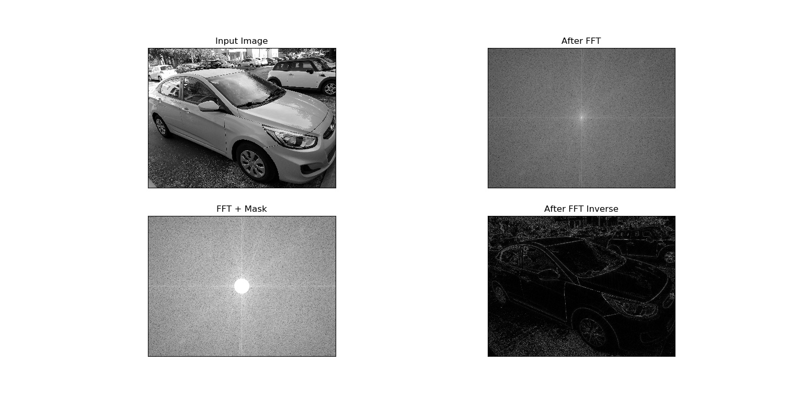

Title: Edge detection in images using Fourier Transform 
Date: 2018-8-24 9:32
Modified: 2018-9-13 12:02
Category: Data Analytics
Tags: Python, Image Processing
Slug: fourier_transform
Authors: Akshay Sinha
Summary: Edge detection in images using Fourier Transform 

### Edge detection in images using Fourier Transform 

Often while working with image processing, you end up exploring different methods to evaluate the best approach that fits your particular needs. I am gonna talk about one such approach here, Fourier Transform.

### But, What is Fourier Transform really ?

In the simplest terms, a fourier transform helps in breaking down a incoming signal into its building blocks. So for example consider a signal f(x) having made by superimposing two or more sinusoidal functions with different frequencies. Now by just looking at the plot of f(x) you wont be able to decide what or how many original functions were used to form f(x).  

This is where Fourier does its magic. By passing f(x) through fourier transformer, we get a new function F(x). What's sweet about F(x) is that it a plot of frequencies that made f(x) originally. So just by looking at F(x) you can tell what original frequencies were that were used to form f(x). In doing so Fourier transform can reveal important characteristics of a signal, namely, its frequency components.

For example, consider the below figure which has a original plot of f(x) and its corresponding fourier transform F(x). 

    Fs = 150.0;  # sampling rate
    Ts = 1.0/Fs; # sampling interval
    t = np.arange(0,1,Ts) # time vector

    ff1 = 5;   # frequency of the signal 1
    ff2 = 10;  # frequency of the signal 2
    y = np.sin(2*np.pi*ff1*t) + np.sin(3*np.pi*ff2*t)
    
**Plot**

As can be seen from the figure, since the original function was made up of two input functions of differing frequencies, the corresponding frequency plot after fourier transform shows two spikes at two different frequencies.

This is a oversimplified explanation of Fourier Transform. Its a pretty complicated but really helpful function which finds its widespread use in mathematics, physics and computer vision.

For someone not familiar with what Fourier transform is and its usage, I strongly recommend watching the below listed excellent videos first before continuing.

* [But what is the Fourier Transform? A visual introduction.](https://www.youtube.com/watch?v=spUNpyF58BY)
* [Fourier Transform, Fourier Series, and frequency spectrum](https://www.youtube.com/watch?time_continue=1&v=r18Gi8lSkfM)

### Fourier Transform in Image Processing

Now we know what fourier transform does for signal processing. It converts the incoming signal from time domain to frequency domain. 

But what use does it have in image processing?, you ask. It actually does kind of the same thing when applied to images that it does to a signal. It converts an input image from spatial domain to frequency domain. What that means is if you were to plot a image after taking its fourier transform, all you would see is a plot of high and low frequencies.

Low frequencies situated towards the center of the image and high frequencies scattered around. A picture speaks a thousand words, so here it is :

Here is the python code to compute and plot the fourier transform of an input image as above.

    import numpy as np
    import cv2
    from matplotlib import pyplot as plt
    
    img = cv2.imread('scenery.jpg', 0)
    dft = cv2.dft(np.float32(img), flags=cv2.DFT_COMPLEX_OUTPUT)
    dft_shift = np.fft.fftshift(dft)
    
    magnitude_spectrum = 20 * np.log(cv2.magnitude(dft_shift[:, :, 0], dft_shift[:, :, 1]))
    
    plt.subplot(2, 2, 1), plt.imshow(img, cmap='gray')
    plt.title('Input Image'), plt.xticks([]), plt.yticks([])
    plt.subplot(2, 2, 2), plt.imshow(magnitude_spectrum, cmap='gray')
    plt.title('After FFT'), plt.xticks([]), plt.yticks([])
  

Ok, so now you have a FFT transform of the image. From here on, there are various things you can do using that FFT transformed image:

* Edge detection - Using a High Pass filter or Band Pass filter
* Noise Reduction - Using a Low Pass filter
* Blurring of image - Using a Low Pass filter
* Feature Extractions(In some cases) - A mix and match of filters and some other openCV tools

In the interest of keeping this post short, I'll cover "Edge Detection" using a HPF filter in this part and will try to cover the rest of the items in part 2. 

### A Bit about filters first

Filters in image processing are just what the name suggests, Filter. They are typically a mask array of the same size as the original image which when superimposed on the ordinal image, extracts only the attributes that we are interested in.

As mentioned earlier, in an FFT transformed image, low frequencies are found in the center and high frequencies are scattered around, we can then create a mask array which has a circle of zeros in the center and rest all ones. Now when this mask is applied to the original image, the resultant image would only have high frequencies. This becomes quite useful as low frequencies correspond to edges in spatial domain.

Although you can choose to use filters of many types, there are mainly three types of filter used:

* High Pass Filter (HPF)
* Low Pass Filter (LPF)
* Band Pass Filter (BPF)

Here's what a HPF looks like in python - Circular HPF mask, center circle is 0, remaining all ones

    # Circular HPF mask, center circle is 0, remaining all ones
    rows, cols = img.shape
    crow, ccol = int(rows / 2), int(cols / 2) 

    mask = np.ones((rows, cols, 2), np.uint8)
    r = 80
    center = [crow, ccol]
    x, y = np.ogrid[:rows, :cols]
    mask_area = (x - center[0]) ** 2 + (y - center[1]) ** 2 <= r*r
    mask[mask_area] = 0

LPF Filter - Circular LPF mask, center circle is 1, remaining all zeros

    # Circular LPF mask, center circle is 1, remaining all zeros
    rows, cols = img.shape
    crow, ccol = int(rows / 2), int(cols / 2) 

    mask = np.zeros((rows, cols, 2), np.uint8)
    r = 100
    center = [crow, ccol]
    x, y = np.ogrid[:rows, :cols]
    mask_area = (x - center[0]) ** 2 + (y - center[1]) ** 2 <= r*r
    mask[mask_area] = 1
    
Band Pass Filter - Concentric circle mask, only the points living in concentric circle are ones

    rows, cols = img.shape
    crow, ccol = int(rows / 2), int(cols / 2) 
    
    mask = np.zeros((rows, cols, 2), np.uint8)
    r_out = 80
    r_in = 10
    center = [crow, ccol]
    x, y = np.ogrid[:rows, :cols]
    mask_area = np.logical_and(((x - center[0]) ** 2 + (y - center[1]) ** 2 >= r_in ** 2),
                               ((x - center[0]) ** 2 + (y - center[1]) ** 2 <= r_out ** 2))
    mask[mask_area] = 1

### Edge Detection with High Pass Filter using openCV and NumPy

Detecting an edge in an image is of great use in the world of computer vision. Once we can extract edges in a image, we can use that knowledge for feature extraction or pattern detection. 

Edges in an image are usually made of High frequencies. So what we need to after taking a FFT (Fast Fourier Transform) of an image is, we apply a High Frequency Pass Filter to this FFT transformed image. This filter would in turn block all low frequencies and only allow high frequencies to go through. Finally, now if you take a inverse FFT on this filter applied image, you should see some distinct edge features in the original image.

I am gonna use my car's image for this experiment :)

Below figure shows all four stages of the process and given after is the python code for the same.

As can be seen, application of high pass filter, blocked all the low frequencies in the center and allowed only the high frequencies to pass through. Now since edges are usually made of low frequencies, that's we see in the resultant image. 

Here is the Python code

 
    rows, cols = img.shape
    crow, ccol = int(rows / 2), int(cols / 2)  # center
    
    # Circular HPF mask, center circle is 0, remaining all ones
    
    mask = np.ones((rows, cols, 2), np.uint8)
    r = 80
    center = [crow, ccol]
    x, y = np.ogrid[:rows, :cols]
    mask_area = (x - center[0]) ** 2 + (y - center[1]) ** 2 <= r*r
    mask[mask_area] = 1
    
    # apply mask and inverse DFT
    fshift = dft_shift * mask
    
    fshift_mask_mag = 2000 * np.log(cv2.magnitude(fshift[:, :, 0], fshift[:, :, 1]))
    
    f_ishift = np.fft.ifftshift(fshift)
    img_back = cv2.idft(f_ishift)
    img_back = cv2.magnitude(img_back[:, :, 0], img_back[:, :, 1])
    
    plt.subplot(2, 2, 1), plt.imshow(img, cmap='gray')
    plt.title('Input Image'), plt.xticks([]), plt.yticks([])
    plt.subplot(2, 2, 2), plt.imshow(magnitude_spectrum, cmap='gray')
    plt.title('After FFT'), plt.xticks([]), plt.yticks([])
    plt.subplot(2, 2, 3), plt.imshow(fshift_mask_mag, cmap='gray')
    plt.title('FFT + Mask'), plt.xticks([]), plt.yticks([])
    plt.subplot(2, 2, 4), plt.imshow(img_back, cmap='gray')
    plt.title('After FFT Inverse'), plt.xticks([]), plt.yticks([])
    plt.show()

[Part two](https://akshaysin.github.io/fourier_lpf.html#.W5oIp-hKhPY) of this blog will cover the implementation and application of Low pass and Band pass filter. 

### Credits

* Special thanks to Grant Sanderson at [3Blue1Brown at youtube](https://www.youtube.com/channel/UCYO_jab_esuFRV4b17AJtAw). He has the best video tutorials for some of the most complicated topics in mathematics. Highly recommended.  
* Also a great thanks to [Eugene Khutoryansky](https://www.youtube.com/channel/UCJ0yBou72Lz9fqeMXh9mkog) for his excellent video on Fourier Transform.

As always, happy coding !!

