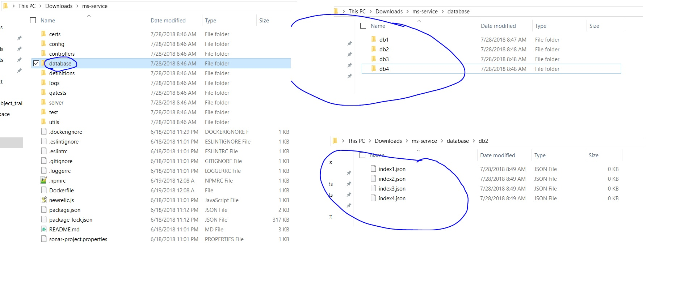
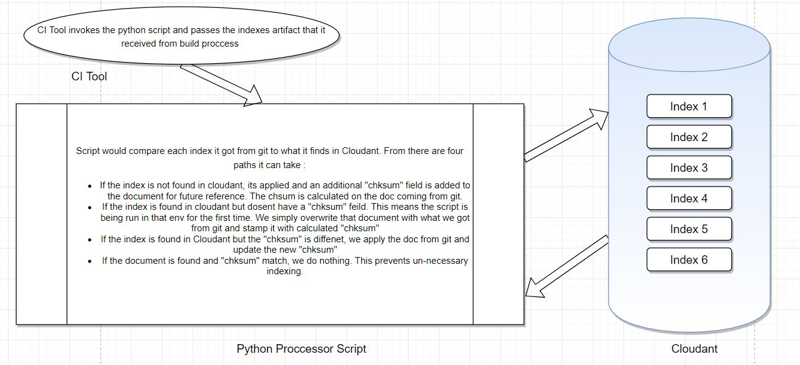

Title: Automated Release Management for cloudant design documents
Date: 2018-7-18 20:42
Modified: 2018-7-18 20:42
Category: Python
Tags: Python, Cloudant, Couchdb
Slug: designdocs_automated
Authors: Akshay Sinha
Summary: Automated Release Management for cloudant design documents

## Automated Release Management for Cloudant design documents

A bit of history about Cloudant, couchdb and thr role of design documents first. That should give us enough context to understand why was this automated proccess needed in first place.

**Systems Involved**

* Nodejs loopback
* Cloudant

**Background**

Historically, the way nosql databases chose to expose their data was, only an indexed field in an database could be used to query data from that database. The `id` field by default is always indexed. The way this works in the background is that cloudant would then use binary tree data structures to store all that data on file system by that field. Now this works great if :

* you don't have a lot of fields in your documents,
* or you don't choose to index all_fields,
* or your databases are not too big.

None of the above applied to us. We had :

* A lot of fields per document. But as would any elaborate implementation would end up having many fields overtime, so did ours.
* What we found was that loopback-cloudant-connector by default imposes a little hack of its own that it will create an `all_fields` index on all the databases that its used with. This might sound harmless at first but imagine having databases the size of 100 Million docs and applying this index on that database. The indexing job on that cluster itself would use up all resources.
* All the databases that we worked with were big to huge in size.

We ended up opening a ticket with loopback cloudant connector support group to suppress this `all_fields` behaviour on their end. And they did. [Here](https://github.com/strongloop/loopback-connector-cloudant/issues/162) is the link to that discussion.

On our end, we decided to only create custom indexes for the fields that were indeed needed by a service at run time. Now I am talking about some 80 databases, on average 4 index documents per database, some 50 microservices, spread across 12 cloudant instances. Moreover since each enviornment was in a different stage of development ay any given time, they might have different versions of the same index document in each env. Logistically deploying and maintaining this manually would have been an nightmare.

Hence we ended up writing a python script to release manage the versions of index documents for each service.

**Solution**

First of all we need to make sure that just like code, indexes were also being source controlled. Also make sure to keep them in the same repository as the service. This comes in handy later. In my case, I asked my developer group to keep the indexes in `database` folder. If there were multiple databases that, that service needed indexes on, I asked them to have multiple sub directories for each database and then add respective indexes under each database. Given here is a screenshot how your directory should look like :

From there it basically went like this :

* At Build time, when doing the build the for the service (npm install et all), also make sure to package the `database` folder as a separate artifact. This will be used at the deployment time.
* Now We wrote up a python script which basically recursively iterated through the `database` folder, read through each index document that was part of build artifact and compared it with what we had in Cloudant. Incase it was found different, the new changes were applied. Otherwise nothing was done.
* Now at deployment time, after the code was successfully deployed, it was an simple matter of running the above script on the indexes artifact (That we got from GIT) against the Cloudant of that env.

That's it.

**Script**

Detailed below is a short description of how that script worked. A picture speaks thousand words, so here it is :

**Code**

Main Logic

      def createIndex(dbname,index_file,checksum):
          db=couch[dbname]
          with open("database/{0}/{1}".format(dbname,index_file)) as json_data:
              jdoc = json.load(json_data)
              # print ("Checksum for {0} is {1}".format(index_file,checksum))
              doc_id=jdoc['_id']
              if doc_id in db:
                  print ("Index {0} already exists. Validating Checksum".format(index_file))
                  existing_doc=db[doc_id]
                  jdoc['_rev']=existing_doc['_rev']
                  if 'ckhsum' not in existing_doc:
                      print (">>> Checksum field not found in Document. This is a first time run. Updating Existing Record")
                      # db.delete(existing_doc)
                      jdoc['ckhsum']=checksum
                      doc_id, doc_rev = db.save(jdoc)
                  elif existing_doc['ckhsum'] != checksum:
                      print (">>> Checksum found but don't match. Updating the existing record with changes")
                      # db.delete(existing_doc)
                      jdoc['ckhsum']=checksum
                      doc_id, doc_rev = db.save(jdoc)
                  else:
                      print (">>> All looks fine, doing nothing")
              else:
                  print ("Index {0} does not exists. This is a new Document.Adding it to database after adding checksum".format(index_file))
                  jdoc['ckhsum']=checksum
                  doc_id, doc_rev = db.save(jdoc)
                  print (">>> Index successfully created on DB : {0}, _id : {1}".format(dbname,doc_id))

Code to walk `database` Directory

      for db in dbnames:
              print ("#############Processing Database {0}".format(db))
              for root, dirs, files in os.walk("database/{0}".format(db)):
                  for file in files:
                      filefullpath=os.path.join(root,file)
                      if (filefullpath.endswith('.json')):
                          checksum=hashlib.md5(open(filefullpath,'rb').read()).hexdigest()
                          createIndex(db,file,checksum)
