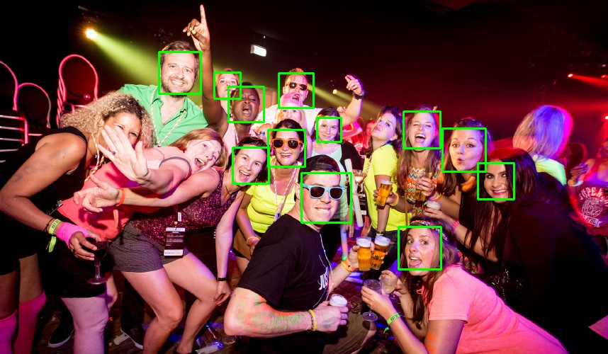

Title: A simple python script to detect and count faces in an image using python's opencv
Date: 2018-7-18 20:15
Modified: 2018-7-18 20:15
Category: Python, Data Analytics
Tags: Python, Image Recognition
Slug: facerecog
Authors: Akshay Sinha
Summary: A simple python script to detect and count faces in an image using python's opencv

## A simple python script to detect and count faces in an image using python's opencv

**[Github Link]()**

In the [last blog](./2018_06_30_pedestrian_count.md) we talked about how to use Python's OpenCV module to detect and count the number of pedestrians in an image. Now using basically the same script lets see how to detect and count number of faces in an image. The only thing that changes between these two scripts is the haar_cascade model that we use to predict the object. Earliar we were using the model trained for full body detection. This time we will use the model to predict the facial patterns and when a match is found, tag it.

### Steps

* Install [openCV](https://docs.opencv.org/3.0-beta/doc/py_tutorials/py_setup/py_setup_in_windows/py_setup_in_windows.html)
* Place the image to be analyzed in root directory of the project. (In this case I use group.jpeg)
* Execute following comand from root of the directory : `python face_detect_cv3.py group.jpeg`
* It takes a few seconds for it to run, you should following output if running against `group.jpeg` image.

      $ python face_detect_cv3.py group.jpg
      Found 11 faces!
      Image written to file-system :  True
      [ INFO:0] Initialize OpenCL runtime...

* If all goes good, you should see a `saved.jpeg` in the root directory. That is the analyzed image.

### Result

Here is a before and after snapshot of the image after the script was executed on the image. Note how it left out three faces. We need better classifier in that base.

### Actual Code

As can be seen below, it only takes a little over 30 lines in total to get this working. I am using openCV library for this task.

      import cv2
      import sys

      # Get user supplied values
      imagePath = sys.argv[1]
      cascPath = "haarcascade_frontalface_default.xml"

      # Create the haar cascade
      faceCascade = cv2.CascadeClassifier(cascPath)

      # Read the image
      image = cv2.imread(imagePath)
      gray = cv2.cvtColor(image, cv2.COLOR_BGR2GRAY)

      # Detect faces in the image
      faces = faceCascade.detectMultiScale(
          gray,
          scaleFactor=1.1,
          minNeighbors=5,
          minSize=(30, 30)
          #flags = cv2.CV_HAAR_SCALE_IMAGE
      )

      print("Found {0} faces!".format(len(faces)))

      # Draw a rectangle around the faces
      for (x, y, w, h) in faces:
          cv2.rectangle(image, (x, y), (x+w, y+h), (0, 255, 0), 2)

      # cv2.imshow("Faces found", image)
      status = cv2.imwrite('saved.jpg', image)
      print ("Image written to file-system : ",status)
      # cv2.waitKey(0)
